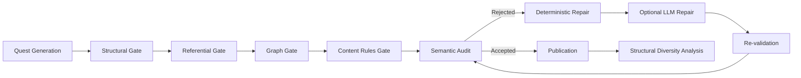

# QuestGuard

**Quality Gates and Diversity-Aware Repair for Reliable LLM-Generated Game Quests**

QuestGuard is a software quality assurance pipeline for generating, validating, repairing, and analyzing structured game quests produced by large language models (LLMs).

Instead of treating a quest as free-form narrative text, QuestGuard treats it as a **software artifact** that must satisfy explicit structural, referential, control-flow, domain, and semantic constraints before publication.

> **Study scope:** QuestGuard is an exploratory proof of concept. It optimizes deployability rather than entertainment value.

## Table of Contents

- [Overview](#overview)
- [Software Engineering Perspective](#software-engineering-perspective)
- [Architecture](#architecture)
- [Validation Gates](#validation-gates)
- [Repair Strategies](#repair-strategies)
- [Experimental Configurations](#experimental-configurations)
- [Experimental Setup](#experimental-setup)
- [Main Results](#main-results)
- [Diversity Scope](#diversity-scope)
- [Repository Structure](#repository-structure)
- [Requirements](#requirements)
- [Installation](#installation)
- [Configuration](#configuration)
- [Running the Pipeline](#running-the-pipeline)
- [Reproducibility](#reproducibility)
- [Known Limitations](#known-limitations)
- [Roadmap](#roadmap)
- [Citation](#citation)
- [Authors](#authors)
- [License](#license)

## Overview

LLMs can quickly produce plausible quests, but fluent text does not guarantee that the output can be safely integrated into a game pipeline. Generated quests may contain invalid JSON structures, missing required fields, nonexistent entity references, incompatible action-target pairs, broken objective dependencies, cyclic quest graphs, generic completion conditions, and repeated structures.

QuestGuard addresses these problems through a staged pipeline of:

1. generation;
2. deterministic quality gates;
3. evidence-adjudicated semantic auditing;
4. deterministic repair;
5. optional LLM repair;
6. re-validation;
7. publication;
8. set-level diversity analysis.

The project provides:

- a modular validation architecture;
- validity-oriented and diversity-aware repair;
- reproducible experiments comparing five configurations;
- stored seeds, prompts, raw responses, validation reports, and repair traces;
- structural diversity metrics for the final quest set.

## Software Engineering Perspective

QuestGuard connects game-content generation to established software engineering concepts.

| QuestGuard component | Software engineering interpretation |
|---|---|
| JSON Schema | Lightweight type system and interface contract |
| Required quest fields | Design-by-contract preconditions |
| Structural gate | Type checking |
| Referential gate | Linking and symbol resolution |
| Graph gate | Control-flow analysis |
| Content rules | Domain-specific static analysis |
| Semantic audit | Evidence-based quality review |
| Quality gates | Software Quality Assurance boundary |
| Re-validation | Regression checking |
| C3 publication policy | Fail-closed Continuous Integration gate |
| Repair pipeline | Automated artifact repair |
| Published quest set | Promoted build artifact |

The JSON Schema acts as an executable contract between the generator and downstream game systems. A quest is accepted only if it satisfies this contract and the additional domain-level analyses.

The C3 configuration follows a Continuous Integration-like policy: generated artifacts are checked automatically, invalid artifacts are blocked, and only validated artifacts are promoted. C4 and C5 extend this cycle with automated repair and re-validation.

## Architecture



The deterministic gates define the reported validity metric. The semantic audit is complementary and evidence-adjudicated; it is not the sole acceptance criterion.

## Validation Gates

### Structural Gate

Validates each artifact against the quest JSON Schema. It detects missing required fields, incorrect types, invalid enumerations, malformed rewards, insufficient objective counts, and unexpected nested structures.

### Referential Gate

Resolves every quest reference against the world repository. It checks whether entities exist and whether actions are compatible with target types.

Examples:

| Action | Expected target |
|---|---|
| `visit` | location |
| `talk` | NPC |
| `collect` | item |
| `inspect` | object |
| `defeat` | enemy |

### Graph Gate

Analyzes the objective dependency graph. It checks unique step identifiers, valid dependency references, absence of directed cycles, root and terminal objectives, and executable ordering.

### Content Rules Gate

Performs domain-specific static analysis over conditions that are inconvenient to express in JSON Schema, including generic completion conditions, untestable success criteria, and invalid domain relations.

### Semantic Audit

Uses an LLM to assess narrative consistency, gameplay clarity, integration readiness, reuse potential, maintainability, and game-design quality.

Every reported issue must provide structured evidence, such as entity IDs, objective indices, JSON paths, and observed values. Unsupported issues are discarded or retained only as advisory metadata.

For example, a claimed giver-rescue contradiction is accepted only if the exact `giver_npc` is also the target of a `rescue` objective. Low semantic scores alone do not invalidate a quest.

## Repair Strategies

### C4 — Validity-Oriented Repair

C4 prioritizes passing the deterministic quality gates. Typical operations include:

- adding or normalizing required fields;
- renumbering objective steps;
- removing invalid dependencies;
- breaking cycles;
- replacing unknown entities;
- correcting incompatible actions or targets;
- rewriting generic completion conditions.

When deterministic repair cannot resolve all issues, QuestGuard may use an optional LLM fallback.

### C5 — Diversity-Aware Repair

C5 preserves the same validity requirements while considering the state of the accepted quest set.

Its principles are:

1. preserve valid targets whenever possible;
2. change the action before replacing the target;
3. prefer less-used compatible entities;
4. penalize repeated structural signatures.

Example:

```text
Invalid:
action: visit
target: object_altar_antigo
target type: object
```

C4 may produce:

```text
action: visit
target: loc_ruinas
target type: location
```

C5 prefers:

```text
action: inspect
target: object_altar_antigo
target type: object
```

C5 preserves the original entity and changes only the incompatible action.

## Experimental Configurations

| Configuration | Description |
|---|---|
| C1 | Prompt-only generation without the quest schema |
| C2 | Schema-guided generation with schema and design rules in the prompt |
| C3 | Quality-gated publication of C2 outputs; invalid artifacts are blocked |
| C4 | Validity-oriented repair of rejected C2 quests |
| C5 | Diversity-aware repair of rejected C2 quests |

C3, C4, and C5 operate on the same C2 artifacts within each run, enabling paired comparison.

## Experimental Setup

The final experiment used:

- model: `llama3.2`;
- local execution through Ollama;
- generation temperature: `0.7`;
- semantic-review temperature: `0.1`;
- `top_p`: `0.9`;
- maximum output: `4096` tokens per call;
- maximum generation attempts: `8`;
- three independent final runs;
- three batches per run;
- ten quests per batch;
- 30 quests per configuration per run;
- 90 quests per configuration across all runs.

Each run used a different base seed. Request seeds were derived from the run seed and request index to preserve run-level reproducibility while allowing retries to produce different continuations.

## Main Results

### Validity and Error Density

| Configuration | Valid/published yield | Mean validation errors per quest |
|---|---:|---:|
| C1 | 0% | 9.67 ± 1.13 |
| C2 | 0% | 3.38 ± 1.31 |
| C3 | 0% | 3.38 ± 1.31 |
| C4 | 100% | 0.00 ± 0.00 |
| C5 | 100% | 0.00 ± 0.00 |

Schema guidance reduced the average error density by approximately **65.1%**, but did not produce fully valid artifacts by itself.

Both repair configurations achieved a **100% final valid-artifact yield**.

### C4 vs. C5 Structural Diversity

| Metric | C4 | C5 | Mean Δ |
|---|---:|---:|---:|
| Quest-type entropy | 0.8853 | 0.8853 | 0.0000 |
| Unique structural signatures | 14.00 | 17.67 | +3.67 |
| Duplicate-signature rate | 0.8333 | 0.6333 | -0.2000 |
| Entity coverage | 0.8431 | 0.8627 | +0.0196 |
| Entity concentration | 0.1496 | 0.1283 | -0.0213 |
| Average pairwise similarity | 0.1554 | 0.1320 | -0.0234 |

Compared with C4, C5 increased unique structural signatures, reduced duplicated structures, lowered entity concentration, and reduced pairwise similarity.

### LLM Repair Cost

Across 90 quests:

- C4 used 2 LLM repair calls;
- C5 used 8 LLM repair calls.

This corresponds to approximately `0.022` calls per quest for C4 and `0.089` calls per quest for C5. Most repairs were therefore deterministic.

## Diversity Scope

QuestGuard currently measures **structural diversity**, not complete narrative or experiential diversity.

The implemented metrics capture:

- quest-type distribution;
- action-target-type sequences;
- structural signatures;
- entity coverage;
- entity concentration;
- pairwise feature similarity.

They do not directly measure fun, emotional impact, pacing, challenge, replay value, perceived novelty, or gameplay experience.

Two quests may be structurally different while producing similar player experiences. Future work will investigate experiential diversity through human evaluation and cost functions related to fun, replayability, challenge, pacing, and perceived gameplay difference.

## Repository Structure

```text
questguard/
├── data/
│   ├── world.json
│   └── quest_schema.json
├── outputs/
│   ├── configuration_experiment/
│   └── experiments/
├── questguard/
│   ├── adapters/
│   │   └── ollama_client.py
│   ├── analysis/
│   │   └── diversity_metrics.py
│   ├── domain/
│   ├── generation/
│   │   ├── baseline_service.py
│   │   └── service.py
│   ├── ports/
│   │   └── llm.py
│   ├── repair/
│   │   ├── diversity_aware.py
│   │   └── orchestrator.py
│   ├── reports/
│   └── validation/
│       ├── base.py
│       └── semantic_validator.py
├── scripts/
│   ├── 02_validate.py
│   ├── 04_analyze.py
│   ├── 08_compare_configurations.py
│   ├── 09_run_c5.py
│   └── 10_aggregate_runs.py
├── tests/
├── config.py
└── README.md
```

Adjust this tree if the public artifact uses a slightly different final organization.

## Requirements

Recommended environment:

- Python 3.10 or newer;
- Ollama installed and running;
- `llama3.2` available locally;
- PowerShell, Bash, or a compatible terminal.

Pull the model:

```bash
ollama pull llama3.2
```

Start Ollama if it is not already running:

```bash
ollama serve
```

## Installation

Clone the repository:

```bash
git clone https://github.com/YOUR-USERNAME/questguard.git
cd questguard
```

Create a virtual environment.

### Windows PowerShell

```powershell
python -m venv .venv
.venv\Scripts\Activate.ps1
```

### Linux/macOS

```bash
python -m venv .venv
source .venv/bin/activate
```

Install dependencies:

```bash
pip install -r requirements.txt
```

If `requirements.txt` has not yet been created, install the project packages and export the environment:

```bash
pip freeze > requirements.txt
```

## Configuration

The main settings are defined in `config.py`.

```python
@dataclass(frozen=True)
class Settings:
    ollama_url: str = "http://localhost:11434/api/generate"
    generation_model: str = "llama3.2"
    review_model: str = "llama3.2"
    generation_temperature: float = 0.7
    review_temperature: float = 0.1
    top_p: float = 0.9
    request_timeout_seconds: int = 360
    max_repair_attempts: int = 3
    max_generation_attempts: int = 8
```

## Running the Pipeline

### Validate Quest Files

Deterministic validation:

```bash
python scripts/02_validate.py   --input outputs/configuration_experiment/C5_final_quests.json   --show-issues
```

Validation with semantic auditing:

```bash
python scripts/02_validate.py   --input outputs/configuration_experiment/C5_final_quests.json   --semantic   --show-issues
```

PowerShell:

```powershell
python scripts/02_validate.py `
  --input outputs/configuration_experiment/C5_final_quests.json `
  --semantic `
  --show-issues
```

### Run the Configuration Comparison

Exploratory 10-quest experiment:

```bash
python scripts/08_compare_configurations.py   --batches 2   --quests-per-batch 5
```

Final 30-quest experiment:

```bash
python scripts/08_compare_configurations.py   --batches 3   --quests-per-batch 10
```

PowerShell:

```powershell
python scripts/08_compare_configurations.py `
  --batches 3 `
  --quests-per-batch 10
```

### Aggregate Independent Runs

Store the final runs under:

```text
outputs/experiments/final_30_run_01/
outputs/experiments/final_30_run_02/
outputs/experiments/final_30_run_03/
```

Then run:

```bash
python scripts/10_aggregate_runs.py
```

### Run the Tests

```bash
python -m pytest -q
```

## Output Files

Typical generated files include:

```text
outputs/
├── configuration_comparison.json
├── validation_report.json
├── validation_summary.json
└── configuration_experiment/
    ├── C1_prompt_only_quests.json
    ├── C2_schema_guided_quests.json
    ├── C3_published_quests.json
    ├── C4_final_quests.json
    ├── C4_repair_records.json
    ├── C5_final_quests.json
    ├── C5_repair_records.json
    ├── C5_diversity_state.json
    ├── C4_C5_diversity_comparison.json
    ├── experiment_metadata.json
    └── raw_responses/
```

## Reproducibility

Each run stores:

- base seed;
- request-seed strategy;
- model names;
- temperatures;
- `top_p`;
- batch count;
- quests per batch;
- raw model responses;
- generation call counts;
- validation reports;
- repair records;
- final quests;
- diversity metrics;
- hashes of generated artifacts.

The current seed strategy is:

```text
request_seed = run_seed + request_index
```

## Known Limitations

- only one local LLM was evaluated;
- the world model contains 17 entities;
- the experiment uses a single quest schema;
- only three independent final runs were performed;
- semantic auditing depends on an LLM reviewer;
- the current metrics measure structural rather than full experiential diversity;
- no blinded human evaluation was conducted;
- no real game-engine execution test was performed;
- latency and token cost were not evaluated in depth.

## Roadmap

Planned work includes:

- evaluation with additional LLMs;
- larger and genre-diverse worlds;
- human evaluation of coherence, fun, clarity, and implementability;
- experiential-diversity metrics;
- cost functions for pacing, challenge, replayability, and enjoyment;
- engine-level execution tests;
- latency and token-cost analysis;
- more independent runs;
- statistical significance analysis;
- integration with game-authoring tools;
- CI automation for quest validation in production pipelines.


## Authors

**Lucas Vieira dos Santos Souza**  
São Paulo State University (UNESP)  
Sorocaba, Brazil  
`lucas.v.souza@unesp.br`

**Leopoldo Lusquino Filho**  
São Paulo State University (UNESP)  
University of Campinas (UNICAMP)  
Brazil  
`leopoldo.lusquino@unesp.br`


## Contact

For questions, issues, or replication support, open a GitHub issue or contact:

`lucas.v.souza@unesp.br`
